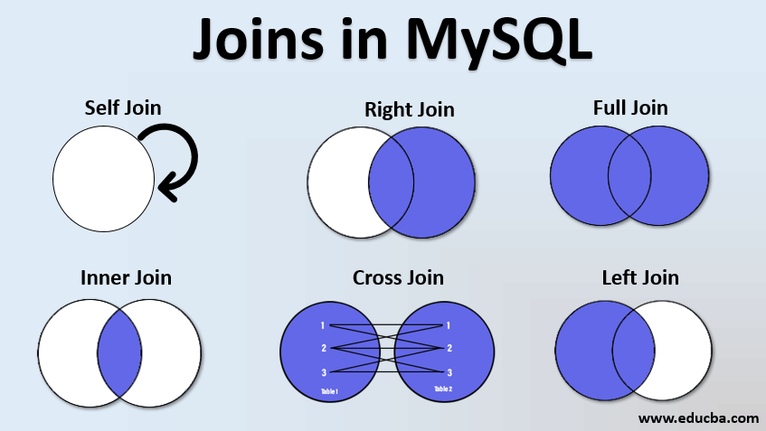

# Database Fundamentals & Basic SQL (MySQL)

> Tài liệu này dành cho lập trình viên Backend/Full-stack muốn xây dựng nền tảng Database vững chắc trước khi học các chủ đề nâng cao như Index, Transaction, Locking, Distributed Database và System Design.

---

# 1. Database Concepts

## Khái niệm
Database (Cơ sở dữ liệu) là nơi lưu trữ dữ liệu có tổ chức để các ứng dụng có thể dễ dàng:
- Lưu dữ liệu
- Truy xuất dữ liệu
- Cập nhật dữ liệu
- Xóa dữ liệu
- Quản lý dữ liệu một cách an toàn

Database thường được quản lý bởi **Database Management System (DBMS)**.

**Ví dụ:**
- MySQL
- PostgreSQL
- SQL Server
- Oracle
- MongoDB

---

## Ứng dụng thực tế
**Ví dụ: Website bán hàng**

Database lưu:
- Danh sách khách hàng
- Danh sách sản phẩm
- Đơn hàng
- Thanh toán
- Kho hàng

Nếu không có Database thì mỗi lần server restart dữ liệu sẽ mất.

---

## Ví dụ luồng hoạt động
```text
Khách hàng ➔ Đăng ký tài khoản ➔ Thông tin được lưu vào Database ➔ Lần sau đăng nhập vẫn còn dữ liệu
```

---

# 2. Relational Database (RDBMS)

## Khái niệm
Relational Database (Cơ sở dữ liệu quan hệ) là loại database lưu dữ liệu dưới dạng các **Table (Bảng)**.

Mỗi bảng gồm:
- **Rows (Record):** Các dòng dữ liệu.
- **Columns (Field):** Các cột thuộc tính.

Các bảng liên kết với nhau thông qua **Primary Key (Khóa chính)** và **Foreign Key (Khóa ngoại)**.

**Ví dụ:**
```text
[Customer Table]          [Order Table]
- id (Primary Key)  ◀───  - id (Primary Key)
- name                    - customer_id (Foreign Key)
- email                   - total
```
Trong đó, `customer_id` liên kết tới `Customer.id`.

---

## Đặc điểm
- Có Schema (lược đồ cấu trúc) rõ ràng.
- Dữ liệu có cấu trúc chặt chẽ.
- Hỗ trợ ngôn ngữ truy vấn SQL.
- Hỗ trợ Transaction, đảm bảo tính chất ACID.

---

## Ứng dụng thực tế
Thường dùng cho các hệ thống yêu cầu độ chính xác dữ liệu cực cao:
- Ngân hàng, tài chính
- Thương mại điện tử (phần thanh toán, đơn hàng)
- Hệ thống quản lý ERP / CRM
- Quản lý nhân sự

---

## Ví dụ thực tế dữ liệu
```text
Customer Table:
+----+------+
| id | name |
+----+------+
| 1  | Huy  |
| 2  | Nam  |
+----+------+

Orders Table:
+-----+-------------+
| id  | customer_id |
+-----+-------------+
| 101 | 1           |
| 102 | 2           |
+-----+-------------+
```

---

# 3. NoSQL Overview

## Khái niệm
NoSQL là nhóm database không bắt buộc lưu dữ liệu dưới dạng bảng quan hệ, giúp tối ưu hóa khả năng mở rộng (Scale-out) và lưu trữ dữ liệu không cấu trúc.

Các loại NoSQL phổ biến:
- **Document Database**
- **Key-Value Database**
- **Column Family Database**
- **Graph Database**

---

## Các loại NoSQL cụ thể

### Document Database
*Ví dụ:* MongoDB
Dữ liệu lưu dưới dạng JSON/BSON.
```json
{
   "name": "Huy",
   "age": 25,
   "skills": ["Java", "SQL"]
}
```

### Key-Value Database
*Ví dụ:* Redis
Dữ liệu lưu trữ dạng cặp khóa - giá trị siêu nhanh.
```text
Key: "user:1001"  ➔  Value: { "name": "Huy", "role": "admin" } (JSON)
```

### Wide Column Family
*Ví dụ:* Cassandra
Tối ưu cho việc ghi và truy vấn lượng dữ liệu khổng lồ (Big Data).

### Graph Database
*Ví dụ:* Neo4j
Lưu trữ các thực thể dưới dạng các Node và mối quan hệ giữa chúng dạng Edge. Rất phù hợp cho mạng xã hội hoặc hệ thống gợi ý (Recommendation).

---

## Ứng dụng thực tế của NoSQL
- **MongoDB:** Hệ thống Blog, CMS, mạng xã hội, dữ liệu cấu trúc thay đổi liên tục.
- **Redis:** Lưu Cache, Session, mã OTP, hàng đợi (Queue).
- **Neo4j:** Phân tích mạng lưới bạn bè (Facebook, LinkedIn), gợi ý sản phẩm.

---

# 4. ACID Properties

## Khái niệm
ACID là 4 tính chất cốt lõi đảm bảo một giao dịch (Transaction) trong database hoạt động chính xác và an toàn.

---

## A - Atomicity (Tính nguyên tử)
Tất cả hoặc không có gì. Tất cả các bước trong Transaction phải thành công, nếu có một bước lỗi thì toàn bộ Transaction phải được rollback (khôi phục lại trạng thái ban đầu).

**Ví dụ chuyển tiền:**
```text
Tài khoản A (-100$) ➔ Hệ thống lỗi khi cộng tiền cho B ➔ Rollback ➔ Tài khoản A vẫn còn nguyên tiền.
```

---

## C - Consistency (Tính nhất quán)
Database phải luôn chuyển từ trạng thái hợp lệ này sang trạng thái hợp lệ khác. Tất cả các ràng buộc dữ liệu (Constraints) phải được bảo toàn.

**Ví dụ:** Số dư tài khoản không bao giờ được phép âm dưới mức quy định (ví dụ: < 0$).

---

## I - Isolation (Tính độc lập)
Các Transaction chạy đồng thời không được ảnh hưởng lẫn nhau. Kết quả của một Transaction chưa hoàn thành không được hiển thị cho các Transaction khác thấy.

**Ví dụ:** Hai người cùng đặt mua 1 sản phẩm cuối cùng trong kho. Database phải cô lập và xếp hàng xử lý để đảm bảo không bị bán quá số lượng tồn kho.

---

## D - Durability (Tính bền vững)
Một khi Transaction đã được COMMIT thành công, dữ liệu phải được lưu vĩnh viễn vào bộ nhớ cứng, kể cả khi hệ thống gặp sự cố mất điện hay sập nguồn ngay sau đó.

---

## Ứng dụng thực tế
Bắt buộc áp dụng trong các giao dịch tài chính, thanh toán ví điện tử, sàn giao dịch chứng khoán để tránh mất mát hoặc sai lệch tiền tệ.

---

# 5. CAP Theorem (Basic)

## Khái niệm
Trong một hệ thống cơ sở dữ liệu phân tán (Distributed Database), ta chỉ có thể đảm bảo tối đa **2 trong 3** tính chất sau đồng thời:
- **C - Consistency (Tính nhất quán):** Tất cả các node đều đọc được dữ liệu mới nhất giống nhau tại cùng một thời điểm.
- **A - Availability (Tính sẵn sàng):** Mỗi yêu cầu gửi đến hệ thống đều nhận được phản hồi (thành công hoặc thất bại), không bị timeout.
- **P - Partition Tolerance (Tính chịu lỗi phân mảnh):** Hệ thống vẫn hoạt động bình thường ngay cả khi đường truyền mạng giữa các node bị đứt gãy hoặc mất kết nối.

---

## Thực tế áp dụng
- **RDBMS truyền thống (MySQL, PostgreSQL):** Ưu tiên **C** (Consistency) và **A** (Availability).
- **NoSQL (MongoDB, Cassandra):** Thường được thiết kế để chịu lỗi phân mảnh mạng tốt hơn, chấp nhận đánh đổi tính nhất quán tức thời (Eventual Consistency) để lấy tính sẵn sàng cao (**AP**).

**Ví dụ thực tế (Amazon):**
Nếu một server replica của Amazon gặp sự cố kết nối mạng, hệ thống vẫn cho phép khách hàng đặt hàng (ưu tiên **Availability**), sau khi mạng ổn định lại sẽ đồng bộ dữ liệu sau (chấp nhận dữ liệu cập nhật chậm vài giây).

---

# 6. Database Architecture

## Kiến trúc cơ bản (Đơn node)
```text
[Application] ➔ [API / Connection Pool] ➔ [Database Server] ➔ [Storage (SSD/HDD)]
```

---

## Kiến trúc Production (Master-Slave / Primary-Replica)
Để chịu tải lớn và tăng tính sẵn sàng cao, kiến trúc thực tế thường phân tách luồng Đọc/Ghi:
```text
                       [Load Balancer]
                              │
                        [Application]
                       ╱             ╲
        (Ghi dữ liệu) ╱               ╲ (Đọc dữ liệu)
                     ▼                 ▼
             [Primary Database] ➔ [Read Replica]
             (Write & Update)   (Đồng bộ)  (Read Only)
                     │                 │
                     ▼                 ▼
                 [Storage]         [Storage]
```

**Ví dụ ứng dụng:**
Trên Facebook, thao tác đăng trạng thái mới (Write) sẽ được gửi tới **Primary Database**, còn thao tác lướt xem bảng tin của hàng triệu người dùng khác (Read) sẽ được phân tải xuống các **Read Replica**.

---

# 7. OLTP vs OLAP

## OLTP (Online Transaction Processing)
Tập trung xử lý các giao dịch trực tuyến thời gian thực với tần suất cao, dữ liệu nhỏ gọn.
- **Tác vụ chính:** Thêm (INSERT), Cập nhật (UPDATE), Xóa (DELETE) dữ liệu.
- **Ví dụ:** Tạo đơn hàng, thanh toán hóa đơn, chuyển khoản.
- **Đặc trưng:** Transaction nhỏ, tốc độ phản hồi cực nhanh (mili-giây).
- **DBMS phù hợp:** MySQL, PostgreSQL, SQL Server.

---

## OLAP (Online Analytical Processing)
Tập trung phân tích dữ liệu lịch sử phục vụ báo cáo và ra quyết định.
- **Tác vụ chính:** Truy vấn đọc (SELECT) dữ liệu cực lớn, tổng hợp dữ liệu (Aggregate like SUM, AVG, GROUP BY).
- **Ví dụ:** Báo cáo doanh thu năm, thống kê hành vi người dùng bằng AI/BI Dashboard.
- **Đặc trưng:** Truy vấn phức tạp, thời gian chạy lâu (vài giây đến vài phút).
- **DBMS phù hợp:** Snowflake, Google BigQuery, Amazon Redshift.

---

## Bảng so sánh nhanh

| Tiêu chí | OLTP (Giao dịch) | OLAP (Phân tích) |
| :--- | :--- | :--- |
| **Mục đích** | Hỗ trợ vận hành kinh doanh hàng ngày | Phân tích và đưa ra quyết định |
| **Tác vụ chủ đạo** | Thêm, sửa, xóa dữ liệu nhanh (Write/Update) | Đọc và tổng hợp dữ liệu lớn (Read/Aggregate) |
| **Tốc độ phản hồi** | Rất nhanh (vài mili-giây) | Lâu hơn (từ vài giây đến vài phút) |
| **Thiết kế dữ liệu** | Chuẩn hóa dữ liệu (Normalized - tránh dư thừa) | Phi chuẩn hóa (Denormalized - tối ưu tốc độ đọc) |

---

# 8. Các câu lệnh SQL cơ bản (MySQL)

## 8.1 CREATE DATABASE
### Mô tả
Tạo một cơ sở dữ liệu mới.
### Cú pháp
```sql
CREATE DATABASE shop_db;
```
### Ứng dụng thực tế
Khởi tạo cơ sở dữ liệu cho dự án website bán hàng mới.

---

## 8.2 USE
### Mô tả
Chọn database làm việc hiện tại.
### Cú pháp
```sql
USE shop_db;
```

---

## 8.3 CREATE TABLE
### Mô tả
Tạo một bảng mới với các cột và kiểu dữ liệu xác định.
### Cú pháp
```sql
CREATE TABLE users (
    id INT PRIMARY KEY AUTO_INCREMENT,
    name VARCHAR(100) NOT NULL,
    email VARCHAR(100) UNIQUE,
    age INT
);
```
### Ứng dụng thực tế
Tạo bảng chứa thông tin đăng ký tài khoản của người dùng.

---

## 8.4 INSERT INTO
### Mô tả
Thêm bản ghi dữ liệu mới vào bảng.
### Cú pháp
```sql
INSERT INTO users (name, email, age)
VALUES ('Huy', 'huy@gmail.com', 25);
```
### Ứng dụng thực tế
Lưu thông tin khi khách hàng đăng ký tài khoản thành công.

---

## 8.5 SELECT
### Mô tả
Truy vấn dữ liệu từ bảng.
### Cú pháp
```sql
-- Lấy toàn bộ các cột
SELECT * FROM users;

-- Chỉ lấy các cột cần thiết (Tốt cho hiệu năng)
SELECT name, email FROM users;
```
### Ứng dụng thực tế
Hiển thị danh sách thông tin khách hàng trên trang quản trị Admin.

---

## 8.6 WHERE
### Mô tả
Lọc dữ liệu dựa trên các điều kiện cụ thể.
### Cú pháp
```sql
SELECT * FROM users
WHERE age >= 18;
```
### Ứng dụng thực tế
Lọc danh sách các tài khoản người dùng đủ 18 tuổi trở lên.

---

## 8.7 ORDER BY
### Mô tả
Sắp xếp kết quả trả về theo thứ tự tăng dần (`ASC`) hoặc giảm dần (`DESC`).
### Cú pháp
```sql
SELECT * FROM users
ORDER BY age DESC;
```
### Ứng dụng thực tế
Hiển thị danh sách khách hàng xếp theo độ tuổi từ cao xuống thấp.

---

## 8.8 LIMIT & OFFSET
### Mô tả
Giới hạn số lượng dòng dữ liệu trả về từ câu truy vấn (`LIMIT`) và bỏ qua một số lượng dòng nhất định từ vị trí bắt đầu (`OFFSET`).
### Cú pháp
```sql
-- Lấy 10 dòng đầu tiên
SELECT * FROM users
LIMIT 10;

-- Bỏ qua 20 dòng đầu tiên, và lấy 10 dòng tiếp theo (dòng 21 đến 30)
SELECT * FROM users
LIMIT 10 OFFSET 20;

-- Hoặc cú pháp viết tắt trong MySQL: LIMIT [offset], [row_count]
SELECT * FROM users
LIMIT 20, 10;
```
### Ứng dụng thực tế
Dùng để phân trang (Pagination).
*Ví dụ:* Trang 1 dùng `LIMIT 10 OFFSET 0`. Trang 2 dùng `LIMIT 10 OFFSET 10`. Trang 3 dùng `LIMIT 10 OFFSET 20`.

---

## 8.9 UPDATE
### Mô tả
Cập nhật/chỉnh sửa dữ liệu của các bản ghi hiện có trong bảng.
### Cú pháp
> [!WARNING]
> Luôn sử dụng kèm điều kiện `WHERE` trong câu lệnh `UPDATE` để tránh việc vô tình cập nhật lại toàn bộ dữ liệu của cả bảng.

```sql
UPDATE users
SET age = 26
WHERE id = 1;
```
### Ứng dụng thực tế
Người dùng thực hiện thay đổi thông tin cá nhân của họ trên hệ thống.

---

## 8.10 DELETE
### Mô tả
Xóa bản ghi dữ liệu khỏi bảng.
### Cú pháp
> [!WARNING]
> Luôn sử dụng kèm điều kiện `WHERE` trong câu lệnh `DELETE` để tránh việc xóa sạch toàn bộ dữ liệu của cả bảng.

```sql
DELETE FROM users
WHERE id = 1;
```
### Ứng dụng thực tế
Khách hàng chọn xóa hoặc hủy kích hoạt tài khoản của mình.

---

## 8.11 DISTINCT
### Mô tả
Loại bỏ các giá trị trùng lặp, chỉ trả về các giá trị duy nhất.
### Cú pháp
```sql
SELECT DISTINCT age FROM users;
```
### Ứng dụng thực tế
Lấy danh sách các độ tuổi khác nhau hiện có trong hệ thống khách hàng.

---

## 8.12 COUNT
### Mô tả
Đếm số lượng dòng dữ liệu thỏa mãn điều kiện.
### Cú pháp
```sql
SELECT COUNT(*) AS total_users FROM users;
```
### Ứng dụng thực tế
Hiển thị tổng số lượng thành viên đã đăng ký trên hệ thống.

---

## 8.13 GROUP BY
### Mô tả
Nhóm các dòng dữ liệu có cùng giá trị lại với nhau để thực hiện các hàm tính toán tổng hợp (COUNT, SUM, AVG,...).
### Cú pháp
```sql
SELECT age, COUNT(*) AS user_count
FROM users
GROUP BY age;
```
### Ứng dụng thực tế
Thống kê xem mỗi độ tuổi có bao nhiêu người đăng ký.

---

## 8.14 HAVING
### Mô tả
Lọc kết quả sau khi đã thực hiện gom nhóm dữ liệu bằng `GROUP BY`.
### Cú pháp
```sql
SELECT age, COUNT(*) AS user_count
FROM users
GROUP BY age
HAVING COUNT(*) > 5;
```
### Ứng dụng thực tế
Chỉ thống kê các nhóm độ tuổi có số lượng người đăng ký lớn hơn 5.

---

## 8.15 AS (Alias)
### Mô tả
Đặt tên tạm thời (bí danh) cho cột hoặc bảng giúp câu lệnh dễ đọc và rõ nghĩa hơn.
### Cú pháp
```sql
SELECT COUNT(*) AS total_users_active FROM users;
```

---

## 8.16 CASE
### Mô tả
Câu lệnh điều kiện trong SQL, tương tự như `if-else` hoặc `switch-case` trong các ngôn ngữ lập trình. Cho phép trả về các giá trị khác nhau tùy thuộc vào điều kiện thỏa mãn.
### Cú pháp
```sql
SELECT name, age,
       CASE 
           WHEN age < 18 THEN 'Trẻ em'
           WHEN age >= 18 AND age < 60 THEN 'Người lớn'
           ELSE 'Người cao tuổi'
       END AS age_group
FROM users;
```
### Ứng dụng thực tế
Phân loại nhóm khách hàng dựa trên độ tuổi hoặc xếp hạng thành viên (như Bạc, Vàng, Kim Cương) dựa trên tổng số tiền mua hàng.

---

## 8.17 COALESCE
### Mô tả
Hàm trả về giá trị khác NULL đầu tiên trong danh sách tham số truyền vào. Nếu tất cả đều là NULL thì trả về NULL.
### Cú pháp
```sql
-- Nếu cột email là NULL, trả về 'Không có email'
SELECT name, COALESCE(email, 'Không có email') AS contact_email 
FROM users;
```
### Ứng dụng thực tế
Xử lý hiển thị thông tin thay thế khi một cột dữ liệu tùy chọn bị thiếu (NULL).

---

## 8.18 NULL handling (Xử lý NULL)
### Mô tả
Trong SQL, `NULL` thể hiện việc không có dữ liệu hoặc dữ liệu chưa xác định. Ta không dùng các toán tử so sánh thông thường như `=`, `<>` để so sánh với `NULL`, mà phải sử dụng toán tử `IS NULL` hoặc `IS NOT NULL`.
### Cú pháp
```sql
-- Lấy danh sách người dùng chưa khai báo email
SELECT * FROM users
WHERE email IS NULL;

-- Lấy danh sách người dùng đã khai báo email
SELECT * FROM users
WHERE email IS NOT NULL;
```
### Ứng dụng thực tế
Lọc danh sách các đơn hàng chưa được thanh toán (ví dụ: `paid_at IS NULL`) hoặc tài khoản chưa kích hoạt.

---

# 9. SQL Joins

SQL Joins được sử dụng để kết hợp dữ liệu từ hai hoặc nhiều bảng dựa trên một cột chung giữa chúng.



Giả sử ta có hai bảng:

**Bảng `customers`**:
| id | name |
| :--- | :--- |
| 1 | Huy |
| 2 | Nam |
| 3 | Vy |

**Bảng `orders`**:
| id | customer_id | total |
| :--- | :--- | :--- |
| 101 | 1 | 250 |
| 102 | 2 | 100 |
| 103 | 99 | 50 | (customer_id = 99 không tồn tại trong bảng customers)

---

## 9.1 INNER JOIN
### Mô tả
Trả về các dòng dữ liệu khi có sự khớp nhau (match) giữa hai bảng ở cột liên kết.
### Cú pháp
```sql
SELECT c.name, o.id AS order_id, o.total
FROM customers c
INNER JOIN orders o ON c.id = o.customer_id;
```
### Kết quả thực tế
| name | order_id | total |
| :--- | :--- | :--- |
| Huy | 101 | 250 |
| Nam | 102 | 100 |

### Ứng dụng thực tế
Lấy danh sách các đơn hàng đã có thông tin khách hàng hợp lệ trong hệ thống.

---

## 9.2 LEFT JOIN (LEFT OUTER JOIN)
### Mô tả
Trả về tất cả các dòng từ bảng bên trái (`customers`), và các dòng khớp từ bảng bên phải (`orders`). Nếu không có dòng khớp ở bảng bên phải, kết quả sẽ chứa các giá trị `NULL`.
### Cú pháp
```sql
SELECT c.name, o.id AS order_id, o.total
FROM customers c
LEFT JOIN orders o ON c.id = o.customer_id;
```
### Kết quả thực tế
| name | order_id | total |
| :--- | :--- | :--- |
| Huy | 101 | 250 |
| Nam | 102 | 100 |
| Vy | NULL | NULL |

### Ứng dụng thực tế
Thống kê tất cả khách hàng kèm theo đơn hàng của họ (nếu có). Những khách hàng chưa mua gì vẫn xuất hiện trong danh sách với thông tin đơn hàng là `NULL`.

---

## 9.3 RIGHT JOIN (RIGHT OUTER JOIN)
### Mô tả
Ngược lại với LEFT JOIN, trả về tất cả các dòng từ bảng bên phải (`orders`), và các dòng khớp từ bảng bên trái (`customers`). Nếu không khớp, bảng bên trái trả về `NULL`.
### Cú pháp
```sql
SELECT c.name, o.id AS order_id, o.total
FROM customers c
RIGHT JOIN orders o ON c.id = o.customer_id;
```
### Kết quả thực tế
| name | order_id | total |
| :--- | :--- | :--- |
| Huy | 101 | 250 |
| Nam | 102 | 100 |
| NULL | 103 | 50 |

### Ứng dụng thực tế
Kiểm tra tính nhất quán dữ liệu: Tìm các đơn hàng mồ côi (không có thông tin khách hàng hợp lệ trong hệ thống).

---

## 9.4 FULL JOIN (FULL OUTER JOIN)
### Mô tả
Trả về tất cả các dòng khi có sự ăn khớp ở một trong hai bảng (kết hợp cả LEFT JOIN và RIGHT JOIN). Nếu không có sự ăn khớp, các giá trị thiếu sẽ là `NULL`.
> [!NOTE]
> MySQL không hỗ trợ từ khóa `FULL JOIN` trực tiếp. Chúng ta giả lập bằng cách sử dụng `UNION` giữa `LEFT JOIN` và `RIGHT JOIN`.
### Cú pháp (MySQL)
```sql
SELECT c.name, o.id AS order_id, o.total
FROM customers c
LEFT JOIN orders o ON c.id = o.customer_id
UNION
SELECT c.name, o.id AS order_id, o.total
FROM customers c
RIGHT JOIN orders o ON c.id = o.customer_id;
```
### Kết quả thực tế
| name | order_id | total |
| :--- | :--- | :--- |
| Huy | 101 | 250 |
| Nam | 102 | 100 |
| Vy | NULL | NULL |
| NULL | 103 | 50 |

### Ứng dụng thực tế
Lấy toàn bộ dữ liệu từ cả hai phía để phân tích báo cáo đối chiếu, bất kể chúng có khớp nhau hay không.

---

## 9.5 CROSS JOIN
### Mô tả
Trả về tích Descartes của hai bảng. Mỗi dòng của bảng thứ nhất sẽ được kết hợp với tất cả các dòng của bảng thứ hai.
### Cú pháp
```sql
SELECT c.name, o.id AS order_id
FROM customers c
CROSS JOIN orders o;
```
*(Nếu bảng customers có 3 dòng, orders có 3 dòng thì kết quả trả về sẽ có 3 x 3 = 9 dòng)*

### Ứng dụng thực tế
Tạo dữ liệu thử nghiệm (Mock Data) hoặc khi cần sinh tất cả các khả năng kết hợp (ví dụ: sinh danh sách tất cả các kích cỡ áo x màu sắc áo).

---

## 9.6 SELF JOIN
### Mô tả
Là kỹ thuật join một bảng với chính nó. Hữu ích khi trong cùng một bảng có mối quan hệ phân cấp (hierarchical relationship).
### Ví dụ thực tế
Giả sử ta có bảng `employees` chứa cột `id`, `name` và `manager_id` (trỏ đến `id` của người quản lý trong cùng bảng).

**Bảng `employees`**:
| id | name | manager_id |
| :--- | :--- | :--- |
| 1 | Minh (CEO) | NULL |
| 2 | Hoàng | 1 |
| 3 | Sơn | 1 |

### Cú pháp
```sql
SELECT e.name AS Employee, m.name AS Manager
FROM employees e
LEFT JOIN employees m ON e.manager_id = m.id;
```
### Kết quả thực tế
| Employee | Manager |
| :--- | :--- |
| Minh (CEO) | NULL |
| Hoàng | Minh (CEO) |
| Sơn | Minh (CEO) |

### Ứng dụng thực tế
Quản lý cây sơ đồ tổ chức công ty, danh mục sản phẩm đa cấp (Category - Subcategory).

---

# 10. SQL Constraints (Ràng buộc dữ liệu)

Constraints là các quy tắc được áp dụng trên các cột của bảng dữ liệu nhằm ngăn chặn việc lưu trữ dữ liệu không hợp lệ, đảm bảo tính nhất quán (Consistency) và toàn vẹn của cơ sở dữ liệu.

---

## 10.1 PRIMARY KEY (Khóa chính)
### Mô tả
Xác định duy nhất một bản ghi trong bảng. Giá trị của cột khóa chính phải là duy nhất (UNIQUE) và không được phép chứa giá trị `NULL`.
### Cú pháp khi tạo bảng
```sql
CREATE TABLE departments (
    dept_id INT PRIMARY KEY,
    dept_name VARCHAR(100) NOT NULL
);
```

---

## 10.2 FOREIGN KEY (Khóa ngoại)
### Mô tả
Là một cột (hoặc nhóm cột) liên kết tới Khóa chính của một bảng khác. Nó thiết lập mối quan hệ cha-con và duy trì tính toàn vẹn tham chiếu (Referential Integrity).
### Cú pháp khi tạo bảng
```sql
CREATE TABLE employees (
    emp_id INT PRIMARY KEY,
    name VARCHAR(100) NOT NULL,
    dept_id INT,
    FOREIGN KEY (dept_id) REFERENCES departments(dept_id)
);
```

---

## 10.3 UNIQUE (Duy nhất)
### Mô tả
Đảm bảo tất cả các giá trị trong một cột phải khác nhau. Khác với PRIMARY KEY, một bảng có thể có nhiều cột UNIQUE và cột UNIQUE có thể chứa giá trị `NULL` (nếu cột đó không bị ràng buộc bởi NOT NULL).
### Cú pháp khi tạo bảng
```sql
CREATE TABLE employees (
    emp_id INT PRIMARY KEY,
    email VARCHAR(100) UNIQUE,
    phone VARCHAR(15) UNIQUE
);
```

---

## 10.4 CHECK (Kiểm tra điều kiện)
### Mô tả
Đảm bảo tất cả các giá trị trong cột phải thỏa mãn một điều kiện logic cụ thể.
### Cú pháp khi tạo bảng
```sql
CREATE TABLE employees (
    emp_id INT PRIMARY KEY,
    salary DECIMAL(10, 2),
    age INT,
    CHECK (salary > 0),
    CHECK (age >= 18)
);
```

---

## 10.5 DEFAULT (Giá trị mặc định)
### Mô tả
Cung cấp một giá trị mặc định cho cột khi người dùng không truyền giá trị vào lúc thực hiện câu lệnh `INSERT`.
### Cú pháp khi tạo bảng
```sql
CREATE TABLE employees (
    emp_id INT PRIMARY KEY,
    status VARCHAR(20) DEFAULT 'ACTIVE',
    created_at TIMESTAMP DEFAULT CURRENT_TIMESTAMP
);
```

---

## 10.6 NOT NULL (Không được để trống)
### Mô tả
Đảm bảo cột đó bắt buộc phải có giá trị, không được để trống (chứa giá trị `NULL`).
### Cú pháp khi tạo bảng
```sql
CREATE TABLE employees (
    emp_id INT PRIMARY KEY,
    name VARCHAR(100) NOT NULL
);
```

---

## 10.7 Hành vi Cascading (ON DELETE CASCADE & ON UPDATE CASCADE)
### Mô tả
Xác định hành động tự động xảy ra đối với các bản ghi con ở bảng chứa Khóa ngoại khi bản ghi cha ở bảng chứa Khóa chính bị Xóa (`DELETE`) hoặc Cập nhật (`UPDATE`).

- **ON DELETE CASCADE**: Khi dòng dữ liệu ở bảng cha bị xóa, toàn bộ các dòng dữ liệu liên kết ở bảng con cũng tự động bị xóa theo.
- **ON UPDATE CASCADE**: Khi khóa chính ở bảng cha bị thay đổi giá trị, giá trị khóa ngoại tương ứng ở bảng con cũng tự động được cập nhật theo.

### Cú pháp khi tạo bảng
```sql
CREATE TABLE orders (
    order_id INT PRIMARY KEY,
    customer_id INT,
    total DECIMAL(10, 2),
    FOREIGN KEY (customer_id) REFERENCES customers(id) 
        ON DELETE CASCADE 
        ON UPDATE CASCADE
);
```
### Ứng dụng thực tế
- Nếu khách hàng xóa tài khoản (`ON DELETE CASCADE`), hệ thống sẽ tự động xóa tất cả các đơn hàng liên quan của khách hàng đó để tránh rác dữ liệu.
- Nếu mã số khách hàng thay đổi (`ON UPDATE CASCADE`), toàn bộ đơn hàng của họ tự động được cập nhật theo mã số mới mà không làm đứt gãy liên kết.

> [!WARNING]
> Sử dụng `ON DELETE CASCADE` cần hết sức cẩn thận vì có thể vô tình xóa hàng loạt dữ liệu quan trọng ở các bảng con mà không có cảnh báo trước.

---

# Tổng kết

Sau khi hoàn thành tài liệu này, bạn cần nắm vững các nội dung cốt lõi sau:
1. **Database** là gì và vai trò của nó trong kiến trúc phần mềm Backend.
2. Sự khác biệt cơ bản giữa **RDBMS** (SQL) và **NoSQL**.
3. Ý nghĩa của tính chất **ACID** đối với độ an toàn của dữ liệu.
4. Cách thức phân bổ tính chất theo **CAP Theorem** trong hệ thống phân tán.
5. Kiến trúc **Master-Slave (Primary-Replica)** dùng cho mục đích mở rộng tải đọc/ghi.
6. Phân biệt rõ ràng mục đích sử dụng của hệ thống giao dịch **OLTP** và phân tích dữ liệu **OLAP**.
7. Thành thạo các câu lệnh **SQL** cơ bản của MySQL để thực hiện trọn vẹn quy trình tạo bảng, quản lý bản ghi (CRUD) và lọc, gom nhóm dữ liệu.
8. Nắm vững bản chất và cách sử dụng các kiểu **SQL Joins** (Inner, Left, Right, Full, Cross, Self) để kết hợp dữ liệu giữa nhiều bảng.
9. Hiểu và áp dụng đúng các **SQL Constraints** (Primary Key, Foreign Key, Unique, Check, Default, Not Null) cùng cơ chế xử lý liên đới **Cascading** để đảm bảo tính toàn vẹn dữ liệu.