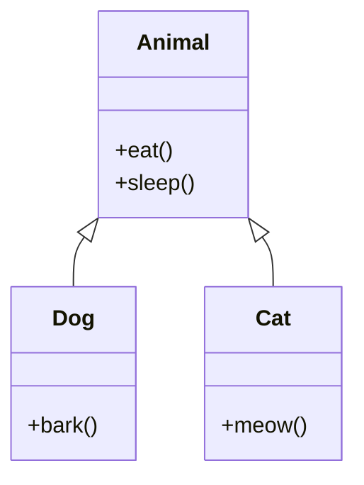
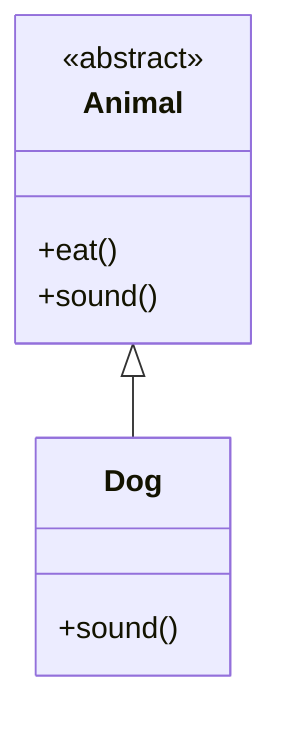
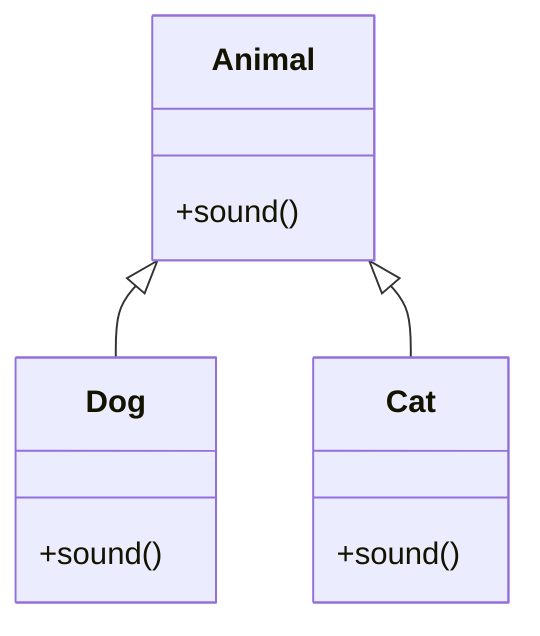
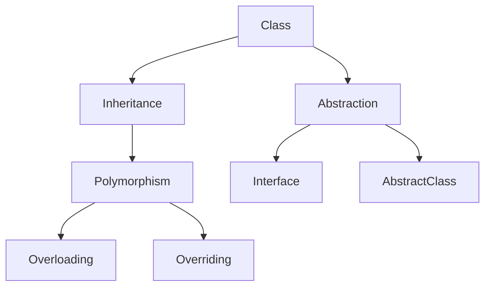

# Java OOP: Inheritance – Abstraction – Polymorphism

---

# Menu

## 1. Inheritance (Thừa kế)

1.1 Khái niệm kế thừa  
1.2 Superclass và Subclass  
1.3 Từ khóa `extends`  
1.4 Quan hệ `is-a`  
1.5 Constructor trong kế thừa  
1.6 Từ khóa `super`  
1.7 Method Overriding  
1.8 Annotation `@Override`  
1.9 Các loại kế thừa trong Java  
1.10 Lớp `Object`  

---

## 2. Abstraction (Trừu tượng)

2.1 Khái niệm trừu tượng  
2.2 Abstract class  
2.3 Abstract method  
2.4 Quy tắc của abstract class  
2.5 Interface  
2.6 Đặc điểm của interface  
2.7 Từ khóa `implements`  
2.8 Multiple inheritance với interface  

---

## 3. Polymorphism (Đa hình)

3.1 Khái niệm polymorphism  
3.2 Compile-time polymorphism (Method Overloading)  
3.3 Runtime polymorphism (Method Overriding)  
3.4 Upcasting  
3.5 Dynamic Method Dispatch  
3.6 Downcasting  

---

## 4. Các khái niệm liên quan

4.1 `instanceof`  
4.2 `final` trong kế thừa  
4.3 Static binding vs Dynamic binding  

---

# 1. Inheritance (Thừa kế)

## 1.1 Khái niệm kế thừa

Kế thừa cho phép một lớp **sử dụng lại thuộc tính và phương thức của lớp khác**.

Mục đích:

- Tái sử dụng code
- Mở rộng chức năng
- Tổ chức hệ thống class

---

## 1.2 Superclass và Subclass

| Thuật ngữ | Ý nghĩa |
|---|---|
| Superclass | Lớp cha |
| Subclass | Lớp con |

Ví dụ:

```java
class Animal {
    void eat(){
        System.out.println("Animal eats");
    }
}

class Dog extends Animal {
    void bark(){
        System.out.println("Dog barks");
    }
}
```

---

## 1.3 Từ khóa `extends`

Dùng để tạo quan hệ kế thừa.

```java
class Dog extends Animal
```

---

## 1.4 Quan hệ `is-a`

Nếu:

```
Dog extends Animal
```

Thì:

```
Dog is an Animal
```

---

## 1.5 Constructor trong kế thừa

Khi tạo object subclass:

```
Constructor lớp cha chạy trước
Constructor lớp con chạy sau
```

Ví dụ:

```java
class Animal {
    Animal(){
        System.out.println("Animal constructor");
    }
}

class Dog extends Animal {
    Dog(){
        System.out.println("Dog constructor");
    }
}
```

---

## 1.6 Từ khóa `super`

Dùng để truy cập thành phần của lớp cha.

Gọi constructor:

```java
super();
```

Gọi method lớp cha:

```java
super.eat();
```

---

## 1.7 Method Overriding

Subclass ghi đè method của superclass.

```java
class Animal {

    void sound(){
        System.out.println("Animal sound");
    }

}

class Dog extends Animal {

    @Override
    void sound(){
        System.out.println("Dog bark");
    }

}
```

---

## 1.8 Annotation `@Override`

Dùng để báo cho compiler biết method đang **override method của lớp cha**.

---

## 1.9 Các loại kế thừa trong Java

Java hỗ trợ:

- Single inheritance  
- Multilevel inheritance  
- Hierarchical inheritance  

Không hỗ trợ:

- Multiple inheritance giữa các class

---

## 1.10 Lớp `Object`

Tất cả class trong Java đều kế thừa:

```
java.lang.Object
```

Một số method quan trọng:

- `toString()`
- `equals()`
- `hashCode()`
- `getClass()`

---

## Sơ đồ kế thừa



---

# 2. Abstraction (Trừu tượng)

## 2.1 Khái niệm trừu tượng

Trừu tượng là quá trình:

```
Che giấu chi tiết cài đặt
Chỉ cung cấp chức năng cần thiết
```

---

## 2.2 Abstract class

Là lớp **không thể tạo object trực tiếp**.

```java
abstract class Animal {

}
```

---

## 2.3 Abstract method

Method **không có thân hàm**.

```java
abstract void sound();
```

---

## 2.4 Quy tắc của abstract class

Abstract class có thể:

- Có abstract method
- Có method thường
- Có constructor
- Có field

Nhưng:

```
Không thể tạo object trực tiếp
```

---

## 2.5 Interface

Interface là **bản thiết kế (contract)** cho class.

```java
interface Animal {

    void sound();

}
```

---

## 2.6 Đặc điểm của interface

Trong interface:

```
method → public abstract
variable → public static final
```

Ví dụ:

```java
interface Animal {

    int MAX_AGE = 100;

    void sound();

}
```

---

## 2.7 Từ khóa `implements`

Class triển khai interface.

```java
class Dog implements Animal {

    public void sound(){
        System.out.println("Bark");
    }

}
```

---

## 2.8 Multiple inheritance với interface

Java cho phép:

```java
class RobotDog implements Animal, Machine {

}
```

---

## Sơ đồ abstraction



---

# 3. Polymorphism (Đa hình)

## 3.1 Khái niệm polymorphism

Polymorphism nghĩa là:

```
Một method có nhiều hình thức hoạt động
```

---

## 3.2 Compile-time polymorphism

Còn gọi là **Method Overloading**.
Xảy ra trong **cùng một class**.

- Tên hàm: Giống nhau.
- Tham số: **Bắt buộc phải KHÁC nhau** (số lượng hoặc kiểu).
- Kiểu trả về: Có thể khác.

```java
class Calculator {
    int add(int a, int b){
        return a + b;
    }
    double add(double a, double b){
        return a + b;
    }
}
```

---

## 3.3 Runtime polymorphism

Còn gọi là **Method Overriding**.

---

## 3.4 Upcasting

Ép kiểu từ subclass → superclass (Con lên Cha).
- **Cú pháp:** Tự động (Implicit).
- **Độ an toàn:** Luôn an toàn.

> **Quy tắc:** Biến tham chiếu (Reference) quyết định phương thức có thể **GỌI**, đối tượng (Object) quyết định phương thức sẽ **CHẠY**.

```java
Animal a = new Dog();
// a.bark(); // LỖI: Animal không biết bark()
a.sound();  // CHẠY: Method của Dog (nhờ đa hình)
```

---

## 3.5 Dynamic Method Dispatch

Java quyết định method chạy **tại runtime**.

```java
Animal a = new Dog();
a.sound();
```

---

## 3.6 Downcasting

Ép kiểu từ superclass → subclass.

```java
Dog d = (Dog) a;
```

---

## Sơ đồ polymorphism



---

# 4. Các khái niệm liên quan

## 4.1 `instanceof`

Kiểm tra object thuộc class nào.

```java
if(animal instanceof Dog){
    System.out.println("This is a Dog");
}
```

---

## 4.2 `final` trong kế thừa

`final class`

```
Không thể bị kế thừa
```

```java
final class MathUtils {

}
```

`final method`

```
Không thể override
```

---

## 4.3 Static binding vs Dynamic binding

| Binding | Thời điểm |
|---|---|
| Static binding | Compile time |
| Dynamic binding | Runtime |

Ví dụ:

```
Overloading → static binding
Overriding → dynamic binding
```

---

# Tổng kết

Ba khái niệm OOP chính:

| Khái niệm | Ý nghĩa |
|---|---|
| Inheritance | Tái sử dụng code |
| Abstraction | Ẩn chi tiết cài đặt |
| Polymorphism | Một hành vi nhiều dạng |

---

## Sơ đồ tổng thể

